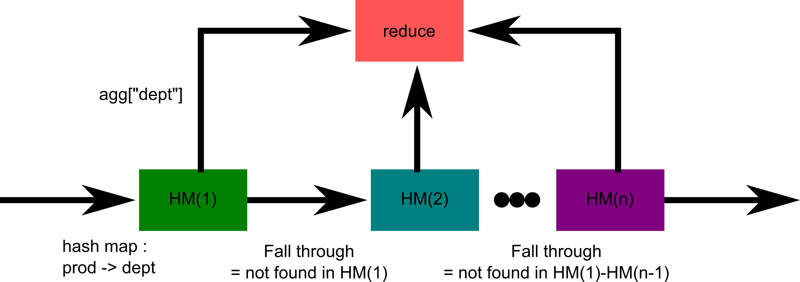

# Insight Coding Challenge

Insight coding challenge

## Problem

SELECT * GROUPBY department COUNT number of requests COUNT number of first time
requests CREATE ratio: number of first time requests/number of requests

## Submission

* Added `insight-cc-bot` into list of collaborators
* [Invite link](https://github.com/frankieliu/insight/invitations)

## Input

Two files from the `input` directory:

1. `order_products.csv` with columns `order_id`, `product_id`,
    `add_to_cart_order`, `reordered`, which are respectively, id for
    the order, id for the product, sequence order added to cart, and
    flag indicating if the product has been used by this user at some
    point in the past, `1` if ordered in the past and `0` if first
    time.

1. `products.csv` with `product_id`, `product_name`, `aisle_id`,
   `department_id`, all we care about is the relationship between
   `product_id` and `department_id` since we want to count the
   number of orders and first time orders by department.

## Output

Output is a single file called `report.csv` in the `output` directory
with `number_of_orders`, `number_of_first_orders` and a `percentage`.

***Nb. instructions call it `percentage`, but really it is a ratio.***

Output should be sorted by `department_id`, if there are no orders
from a department, should not list it.  `percentage` is rounded to
the second decimal place (i.e. hundredths).

## Running instructions

`run.sh` is bash script.  Requires executable `python3` to be in the path, there
are no other dependencies.  Main program is found in `src` directory.

## Approach

1. There is a generic args() function for taking the input file name from the CLI.
1. There are two generators for parsing through the input files.
1. There is a main which does the following:
   1. Generate a hash map from `product_id` to `department_id`
   1. For each department create a dataframe containing `orders` and
      `first` "columns".  It would be more natural to use pandas here
      for a column, but for this exercise just using a dictionary for
      each department, think of them as attributes or fields for each
      department.
   1. Go through each line in the order file, and increment the respective
      counters.
   1. Filter the result by departments that have an order and output a
      ratio of the first time orders to number of orders.

## General considerations
1. In general, I tried not import any external modules, to lower the
   dependencies for running this code.
1. A more robust CLI parser `getopt` could be used.
1. For parsing csv files one should just use `csv.reader`, with the
   `quotechar='"'` `quoting=csv.QUOTE_ALL`, and
   `skipinitialspace=True` option, these should take care of any
    commas within the quotes.
1. Time complexity: O(# product ids + # orders), Space complexity: O(#
   product ids + # departments) The time complexity is due to the hash
   map creation plus the time to go through the orders.  The space
   complexity is for storing the hash map and the aggregate count for
   each department.

## Scalability issues
1. For much larger product to department table, say with 1 billion
   elements would become prohibitively large to store in memory.  In
   this case, we could create a smaller hash map with 10 million
   elements, such that only a subset of the products are represented.

1. We can then pipe the order list line by line through this first
   hash map and aggregate on the products that have an entry on the
   hash map.  If the product id is fonud in the hash map, then it need
   not go to the next stage in the pipeline.  Only elements which are
   not found in the hash map are passed on to another processing node.

1. For lines with products which are not found they are passed to another
   processing block with contains another subset of the hash map, i.e.
   another 10 million entries.

1. After all lines go through the system, the individual processing
   units forward their aggregates to a central processing unit to
   reduce the count from each of the pipeline stages.

1. Each order line, may in the worst case, may pass through all the
   processing blocks.  The time complexity still has O(# of orders).
   And it is not multiplied by O(# products), which is proportional to
   the number of processing stages, because lines arrive in a pipeline
   fashion, i.e. nothing is waiting for the next item to be processed.
   However latency is increased, we can argue that for long enough
   order lists, this latency is insignificant.

1. At each interface, one can add a message queue, so as to allow for
   asynchronous pipelining, similarly the reduce operation for the
   partial aggregates can be added to a single processing queue, so
   that the internal state in the reducer does not have to handle the
   concurrent requests from the pipeline stages.  For this topology,
   the individual pipeline stages can locally aggregate and when the
   "EOF" signal goes through it, send its results to the reducer.

   

## Test cases

## Extensions
